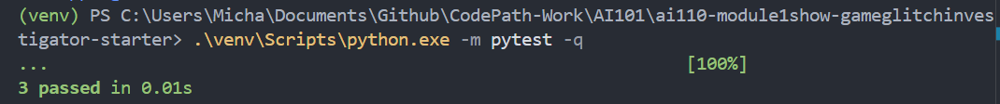
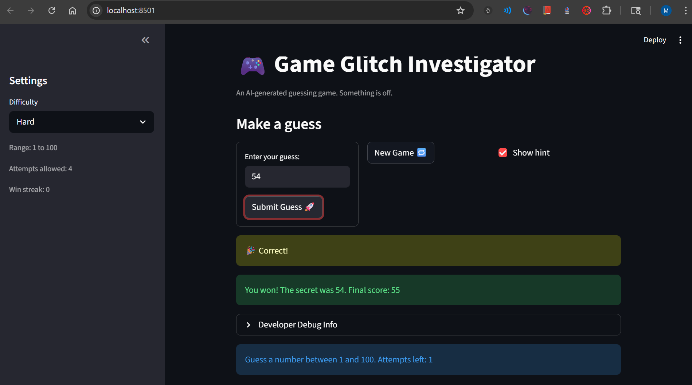

# 🎮 Game Glitch Investigator: The Impossible Guesser

## 🚨 The Situation

You asked an AI to build a simple "Number Guessing Game" using Streamlit.
It wrote the code, ran away, and now the game is unplayable. 

- You can't win.
- The hints lie to you.
- The secret number seems to have commitment issues.

## 🛠️ Setup

1. Install dependencies: `pip install -r requirements.txt`
2. Run the broken app: `python -m streamlit run app.py`

## 🕵️‍♂️ Your Mission

1. **Play the game.** Open the "Developer Debug Info" tab in the app to see the secret number. Try to win.
2. **Find the State Bug.** Why does the secret number change every time you click "Submit"? Ask ChatGPT: *"How do I keep a variable from resetting in Streamlit when I click a button?"*
3. **Fix the Logic.** The hints ("Higher/Lower") are wrong. Fix them.
4. **Refactor & Test.** - Move the logic into `logic_utils.py`.
   - Run `pytest` in your terminal.
   - Keep fixing until all tests pass!

## 📝 Document Your Experience

- [ ] Describe the game's purpose.
- [ ] Detail which bugs you found.
- [ ] Explain what fixes you applied.

Answer: Answered mostly in reflecton and below. In brief, the game is a number guessing game where the user has to guess a secret number within a certain range based on the chosen difficulty level. The user has a limited number of attempts to guess the number, and they receive hints whether their guess is too high or too low. The game also tracks the user's win streak. The bugs I found included the secret number changing every time I clicked "Submit", the hints being incorrect, and the game not resetting properly when clicking "New Game". I fixed these issues by implementing proper state management using Streamlit's session state, correcting the logic for providing hints, and ensuring that the game resets correctly when needed.

## 📸 Demo

- [ ] [Insert a screenshot of your fixed, winning game here]

## 🚀 Stretch Features

- [ ] [If you choose to complete Challenge 4, insert a screenshot of your Enhanced Game UI here]

Answer: This project has developed from a simple README.md to a complete and functional Streamlit-based number-guessing game, with the user needing to guess the secret number within a certain limit based on the chosen difficulty level. Although the initial code within the app.py and logic_utils.py files contained severe logic problems, including the reverse hints and the secret number being reset each time the application was rerun, the current version of the game includes proper state management. With the st.session_state.secret attribute, the game now properly maintains the answer and only resets it when the difficulty level is changed or the 'New Game' option is selected. Additionally, the check_guess function has been corrected to provide proper hints to the user with either 'HIGHER' or 'LOWER' feedback, instead of the reverse hints provided earlier. To validate the updated code, pytest has been successfully employed within the virtual environment, with all three test cases running successfully. Finally, the win streak feature has been integrated into the game to provide a competitive edge to the game, with the win streak being reset only when the game is lost or the 'New Game' option is chosen.

